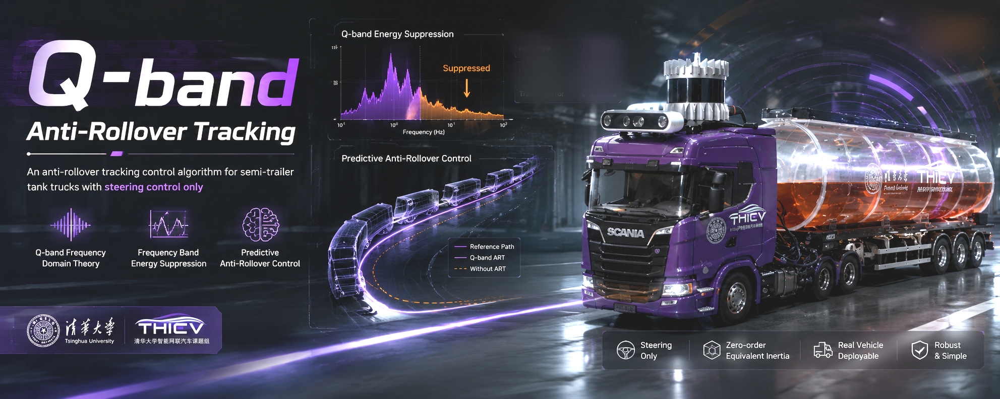

<h1>Q-band Anti-Rollover Tracking Control</h1>

  
  
  

$Q_{band}$ -ART is an anti-rollover tracking control algorithm for semi-trailer tank trucks with steering control only, utilizing self-proposed $Q_{band}$ frequency domain theory and zero-order equivalent inertial properties for  simplificated modeling for semi-trailer trucks. This algorithm is the most powerful anti-rollover alogritiom that I've ever invented throughout my master's degree in Tsinghua University, it is able to be deployed with almost no difficulty on any real vehicles. Tests has been made on 1:14 model trucks, and the real vehicle deployment is comming soon.

<!-- 

  

  

 -->

## Introduction

## Getting Started

---
## Contributors

- [Komasa Qi](https://github.com/KomasaQi) Tsinghua University
- [Linhao Gong](https://github.com/linhaogong-6) Jiangsu University of Technology
- [Kunpeng Wang](https://github.com/PCWL2000) Chang'an University
